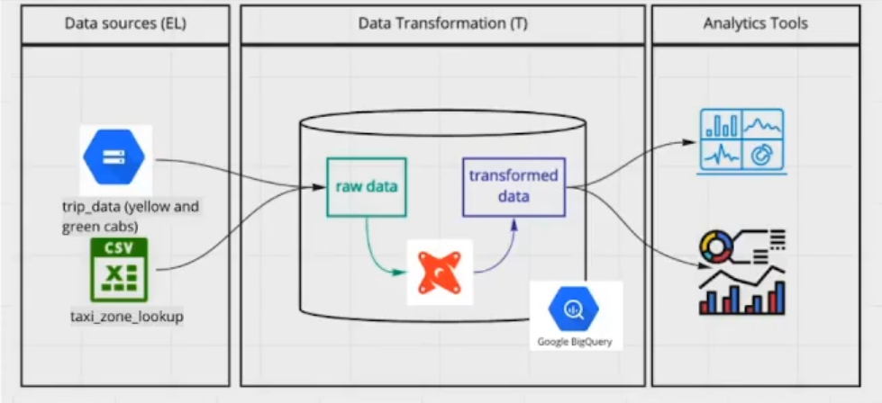

# 4.1.1 - Analytics Engineering Basics

## 1: What is Analytics Engineering?

### Roles in a Data Team

| Data Engineer | Analytics Engineer | Data Analyst |
| - | - | - |
| Prepares and maintains infrastructure the data team needs | Introduces good software engineering practices to the efforts of data analysts and data scientists | Uses data to answer questions/solve problems |
| Better software engineers, less training in how to actually use the data | Tries to fill gap between Data Engs and Analysts | Not trained as software engineers, not first priority |
 

### Tools of an Analytics Engineer

1. Data Loading
2. Data Storing
    - Cloud data warehouses like *Snowflake*, *BigQuery*, *Redshift*
3. Data Modelling
    - Tools like dbt or Dataform
4. Data Presentation
    - BI tools like Google data studio, Looker, Mode, or Tableau
 

## 2: Data Modelling Concepts

### ETL vs ELT  

| ETL | ELT |
| - | - |
| Takes longer to implement, first have to transform data | Faster and more flexible, takes advantage of cloud data warehousing |
| Slightly more stable and compliant data analysis | Faster/more flexible data analysis |
| Higher storage/compute costs | Lower cost/maintenance | 

### Kimball's Dimensional Modeling

Objective:
- Deliver data understandable to the business users
- Deliver fast query performance

Approach:
- Prioritize user understandability and query performance over non-redundant data (3NF)

Other approaches:
- Bill Inmon
- Data Vault 

### Elements of Dimensional Modeling

Also known as the *star schema*.

**Facts Tables**
- Measurements/metrics/facts
- Corresponds to a business process
- "*verbs*": sales, orders

**Dimensions Tables**
- Corresponds to a business *entity*
- Provides context to a business process
- "*nouns*": customer, product 

### Architecture of Dimensional Modeling

Analogy: a restuant

**Stage Area**: *the ingredients*
- Contains the raw data
- Not meant to be exposed to everyone

**Processing Area**: *the kitchen*
- From raw data to data models
- Focuses in efficiency
- Ensuring standards

**Presentation Area**: *the dining area*
- Final presentation of the data
- Exposure to the business stakeholder 

 ## 3: What is dbt?

 [dbt: *Data Built Tool*](https://www.getdbt.com/)
 >A transformation too that allows anyone who knows SQL to deploy analytics code following software best practices like modularity, portability, CI/CD (Continuous Integration and Continuous Delivery), and documentation

 > dbt is a transformation workflow that helps you get more work done while producing higher quality results. You can use dbt to modularize and centralize your analytics code, while also providing your data team with guardrails typically found in software engineering workflows. Collaborate on data models, version them, and test and document your queries before safely deploying them to production, with monitoring and visibility.

### How does dbt work?

Each model is:
- A *.sql file
- Select statement, no DDL or DML
- A file that dbt will compile/run in our data warehouse

### How do you use dbt?

| dbt Core | dbt Cloud |
| - | - |
| The "essence" of dbt: compilation logic, macros, several db adapters | Web application to develop/manage dpt projects |
| Open-source project that allows data transformation |  SaaS app to develop and manage dbt projects |
| Builds/runs a dbt project (.sql/.yml) | Web-based IDE to develop, run, test a dbt project |
| Includes SQL compilation logic, macros, database adapters | Jobs orchestration |
| Includes a CLI interface to run dbt commands locally | Logging/alerting/integrated documentation |
| Open-source/free to use | Free for individuals |

### How are we going to use dbt?

BigQuery
- Development using cloud IDE
- no local installation

Will take data from the source, import as raw data, and use dbt to transform data within the warehouse.

# 4.2.1 - Start Your dbt Project: BigQuery and dbt Cloud (Alternative A)

The taxi data are represented at the below links from 2019-01 - 2021-07:
https://github.com/DataTalksClub/nyc-tlc-data/releases/download/yellow/yellow_tripdata_2019-01.csv.gz
https://github.com/DataTalksClub/nyc-tlc-data/releases/download/green/green_tripdata_2019-01.csv.gz