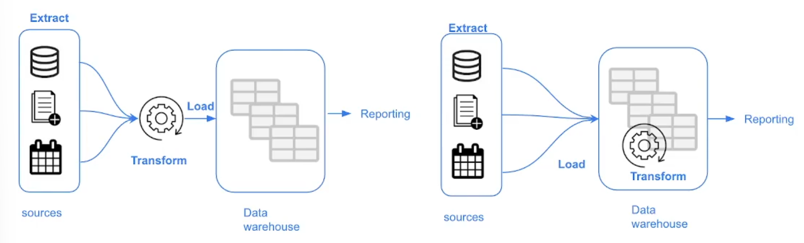

# 4.1.1 - Analytics Engineering Basics

## 1: What is Analytics Engineering?

### Roles in a Data Team

| Data Engineer | Analytics Engineer | Data Analyst |
| - | - | - |
| Prepares and maintains infrastructure the data team needs | Introduces good software engineering practices to the efforts of data analysts and data scientists | Uses data to answer questions/solve problems |
| Better software engineers, less training in how to actually use the data | Tries to fill gap between Data Engs and Analysts | Not trained as software engineers, not first priority |

### Tools of an Analytics Engineer

1. Data Loading
2. Data Storing
    - Cloud data warehouses like *Snowflake*, *BigQuery*, *Redshift*
3. Data Modelling
    - Tools like dbt or Dataform
4. Data Presentation
    - BI tools like Google data studio, Looker, Mode, or Tableau

## 2: Data Modelling Concepts

### ETL vs ELT  

